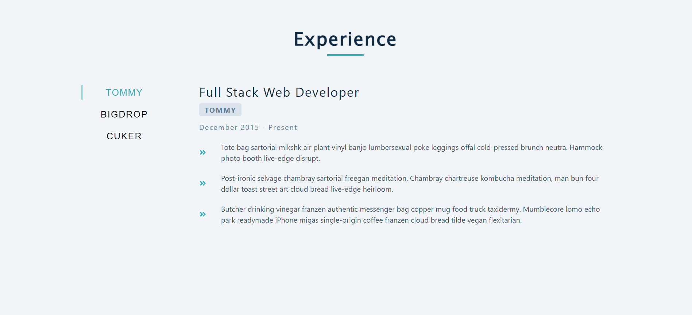

# Tab React Project

To start project

1. Download or clone git repository

2. Install dependencies `npm install`

3. Start server `npm start`

---

Completed [project](https://tabs-jobs-react-by-malina.netlify.app/)

#### In action [here](https://portfolio-strapi-project-by-malina.netlify.app/)

---

#### Screenshots

